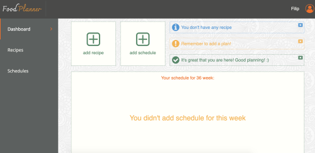

# ScrumLab Food Planner React App

  
  
# Technology stack:

- **JavaScript**
- **React.js**
- **Redux**
- **Sass**
- **JSON-server**

```bash
npm install 
```

Installs node_modules in your IDE

```bash
npm start
```

Runs the app in the development mode.
Open http://localhost:3000 to view it in the browser.

The page will reload if you make edits.
You will also see any lint errors in the console.
